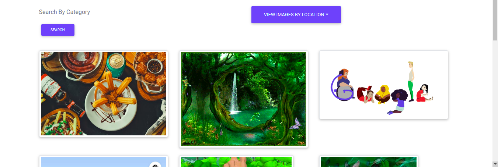

# pic's Gallery

## Build by [Kolem Edwin]

## Description

This is a web application that allows users to view photos stored in galleries by location. The admin is responsible for uploading,editing and deleting of photos.

## Screenshot images





## Live page

https://github.com/edwinkipchumba/gallery-app

## User stories

These are the characteristics application implements for user by application.

Users would like to:

1. View all photos submitted.
2. click on photo to display more details.
3. search for photos by category.
4. copy links to photos and share.

## Admin Abilities

These are the behaviours the application implements for use by admin.

Admin roles:

1. sign in to the gallery.
2. create new photo shocasing.
3. delete photos.
4. update the gallery.

## Behaviour Driven Development (BDD)

| Behaviour | Input | Output |
| :-----------------| :-----------------: | ------------------: |
| Admin Authentication | On demand | Access Admin dashboard |
| Display all photos | Home page | Clickable links to open any photos in a model |
| Display single photos on click | On click | All details should be viewed |
| To add a photo | Through Admin dashboard | Add and add categories and tag location of photo |
| To edit a photo | Through Admin dashboard | Redirected to the photo form details |
| To delete a photo | Through Admin dashboard | Click on photo and confirm by deleting button |
| To search a photo | Enter text in search bar | Users can search by category |
| To filter by location | click drop-down menu on navbar | Users can view photos by location |

## Setup | Installation Requirements

1. python3.8
2. virtualenv
3. requirements.txt
4. django

## Cloning

* Open Terminal {Ctrl+Alt+T}

```
$git clone https://github.com/edwinkipchumba/gallery-app
```
```
$cd gallery
```

* open based on the text editor you have.

## Running the Application

* Creating the virtual environment

 $ python3 -m venv --without-pip virtual

$ source virtual/bin/activate

$ curl https://bootstrap.pypa.io/get-pip.py | python

* Installing Django and other Modules

$ see Requirements.txt

* To run the application, in your terminal:

$ python3 manage.py runserver

## Technology used

* django and postgresql
* HTML5
* css
* Bootsrap5
* python3.8

## Known Bugs

If you find a bug, kindly feel free to comment an issue here and inlcude their corresponding results.

## Contact  Information

 Feel free to contact me incase of any issue or questions, ideas and concern towards the same.

* Contact Number:+254728357619
  
* E-Mail: edwinkolem5@gmail.com.

## License

https://github.com/edwinkipchumba/gallery-app/blob/master/LICENSE